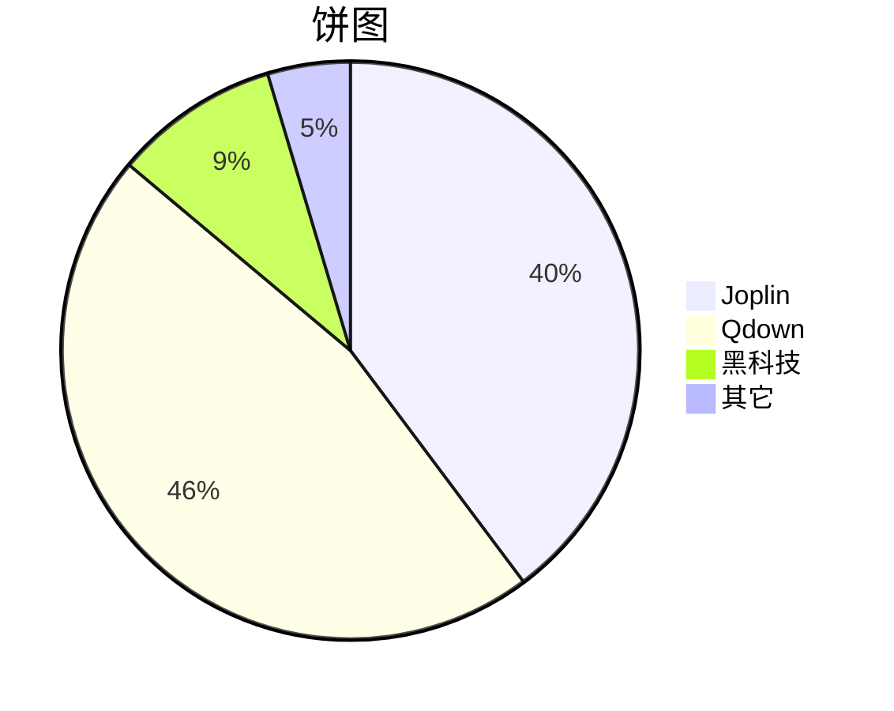
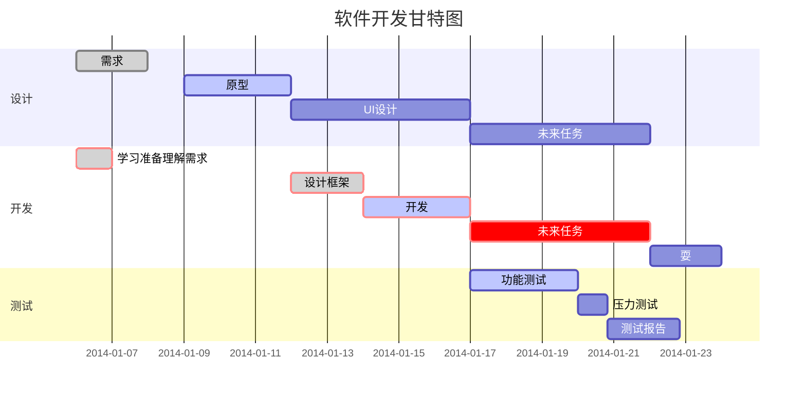

# MarkdownSyntaxTest
markdown的语法和测试文件
下面可以直接文件到到markdown源码文件中，具体效果可以参考[效果图](https://github.com/AndyZhangHong/MarkdownSyntaxTest/blob/main/%E6%B5%8B%E8%AF%95%E8%AF%AD%E6%B3%95.md)
流程图测试网站：[mermaid](https://mermaid.live/)


<pre><code>
## Markdown 目录

- 在文中放置`[toc]`

## Markdown 标题

- 在标题前放置 1~6 个`#`号

# 一级标题

## 二级标题

### 三级标题

#### 四级标题

##### 五级标题

###### 六级标题

---

## Markdown 段落格式

### 常用通用部分

- 用 1~3 个`*`包裹文本分别实现斜体、粗体、粗斜体，不推荐使用 `_` 。

- 这是`*`包裹的*斜体*文本，这是`_`包裹的_斜体_文本

- 这是`**`包裹的**粗体**文本，这是`__`包裹的__粗体__文本

- 这是`***`包裹的***粗斜体***文本，这是`___`包裹的___粗斜体___文本

### 非常用通用部分

- 下标：使用`~`包裹文本，如 H~2~O
- 上标：使用`^`包裹文本，如 X^2^
- 高亮：使用`==`包裹文本，如==highlight==
- 删除线：使用`~~`包裹文本，如~~删除线~~
- 下划线：使用`&lt;u&gt;`包裹文本，如&lt;u&gt;带下划线文本&lt;/u&gt;
- 脚注：

  ```
  脚注[^脚注文本]
  [^脚注文本]: 脚注的内容
  ```

  脚注[^脚注文本]

  [^脚注文本]: 脚注的内容

- 分隔线：3 个及以上连续的`-`

---

## Markdown 列表

### 无序列表

在`-`后面带一个空格，不推荐使用 `+` 和 `*`。

- 无序列表 `-`
- 无序列表 `-`
- 无序列表 `-`

- 无序列表 `*`

+ 无序列表 `+`

### 有序列表

在阿拉伯数字后面带一个`.`和一个空格

1. 有序列表`1.`
2. 有序列表`2.`

### 列表嵌套

- 在无序列表中嵌套对象，需要在对象的行首放置 2 个空格。
- 在有序列表中嵌套对象，需要在对象的行首放置 3 个空格。

- 列表嵌套 `-`
  1. 列表嵌套 `-1.`
  - 列表嵌套 `--`

1. 列表嵌套 `1.`
   1. 列表嵌套 `1.1.`
   - 列表嵌套 `1.-`

### 任务列表

在 `+` 后面带一个空格，在空格后再带一个 `[ ]` ， `[ ]` 的后面再带一个空格， `[ ]` 里面为一个空格时表示任务未完成， `[ ]` 里面为一个 `x` 时表示任务已完成。不推荐使用 `-` 和 `*`。

+ [x] 已完成任务 `+ [x]`
+ [ ] 待完成任务 `+ [ ]`
  + [ ] 待完成任务 `__+ [ ]`

- [x] 已完成任务 `- [x]`

* [x] 已完成任务 `* [x]`

## Markdown 表格

- 用 `|` 分隔单元格，用 `-` 分隔表头和其他行，用 `:` 控制对齐方式

```markdown
| 表头   | 左对齐 | 右对齐 | 居中对齐 |
| ------ | :----- | -----: | :------: |
| 单元格 | 单元格 | 单元格 |  单元格  |
| 单元格 | 单元格 | 单元格 |  单元格  |
```

| 表头   | 左对齐 | 右对齐 | 居中对齐 |
| ------ | :----- | -----: | :------: |
| 单元格 | 单元格 | 单元格 |  单元格  |
| 单元格 | 单元格 | 单元格 |  单元格  |

## Markdown 区块

### 区块引用

- 在行首放置 1 个 `&gt;`

&gt; 区块引用

### 区块引用嵌套

在行首放置多个 `&gt;` ，段落和列表的下一行放置 `&gt;` 时会自动对区块引用进行嵌套

&gt; 最外层
&gt; &gt; 第一层嵌套
&gt; &gt; &gt; 第二层嵌套

## Markdown 代码

### 行内代码

- 用 &lt;code&gt;`&lt;/code&gt; 包裹行内代码

### 代码区块

- 推荐使用&lt;code&gt;```&lt;/code&gt;包裹代码块并声明所用语言，不推荐在代码块的行首放置 4 个空格或 1 个制表符

#### 行首放置空格

在代码块的行首放置 4 个空格，段落和代码区块之间至少空一行。

    h1  {
    font-size: 24px;
    text-align: left;
    background-repeat: no-repeat;
    background-position:center left;
    }

#### 包裹代码块：段落

段落和代码区块之间可以有空行

```CSS
h1  {
font-size: 24px;
text-align: left;
background-repeat: no-repeat;
background-position:center left;
}
```

## Markdown 链接

### 普通链接

```markdown
&lt;链接地址&gt;
[链接名称](链接地址)
[链接名称](链接地址 "可选标题")

&lt;https://markdown-here.com&gt;
[Markdown Here](https://markdown-here.com)
[Markdown Here](https://markdown-here.com "Markdown Here 标题")
```

&lt;https://markdown-here.com&gt;

[Markdown Here](https://markdown-here.com)

[Markdown Here](https://markdown-here.com "Markdown Here 标题")

### 锚点链接（在文档的结尾为变量赋值）

```markdown
[链接名称][网址变量]
[网址变量]:链接地址

[Markdown Here][markdown_here_url]
[Markdown_Here_url]:https://markdown-here.com
```

[Markdown Here][markdown_here_url]

[Markdown_Here_url]:https://markdown-here.com

## Markdown 图片

### 一般图片链接

```markdown


)

```


### 高级链接

- 在文档的结尾为变量赋值

```markdown
![alt 属性文本][图片地址变量]
[图片地址变量]: 图片地址

![红色星球][Sky-seeker_url]
[Sky-seeker_url]: https://cn.bing.com/th?id=OHR.RedPlanetDay_ZH-CN4913018041_1920x1080.jpg

&lt;img src="https://markdown-here.com/img/icon256.png" width="50%"&gt;
```

![红色星球][Sky-seeker_url]
[Sky-seeker_url]: &lt;https://cn.bing.com/th?id=OHR.RedPlanetDay_ZH-CN4913018041_1920x1080.jpg&gt;

&lt;img src="https://cn.bing.com/th?id=OHR.RedPlanetDay_ZH-CN4913018041_1920x1080.jpg" width="10%"&gt;

## Markdown 高级技巧

### 支持的 HTML 元素

- 不在 Markdown 涵盖范围内的标签，都能直接使用。目前支持的 HTML 元素有：`&lt;kbd&gt; &lt;b&gt; &lt;i&gt; &lt;em&gt; &lt;sup&gt; &lt;sub&gt; &lt;br&gt;`等。

  ```
  1. 使用 &lt;kbd&gt;Ctrl&lt;/kbd&gt;+&lt;kbd&gt;Alt&lt;/kbd&gt;+&lt;kbd&gt;Del&lt;/kbd&gt; 重启电脑
  2. 特殊符号 &amp;copy; &amp;trade; &amp;amp; 18&amp;ordm;C
  3. &lt;span style="color: red;"&gt;这是一行红色的文字&lt;/span&gt;
  4. 插入视频
  &lt;video src="$appres/images/example.mp4"&gt;&lt;/video&gt;
  5. Emoji 表情 :smiley:
  ```

  1. 使用 &lt;kbd&gt;Ctrl&lt;/kbd&gt;+&lt;kbd&gt;Alt&lt;/kbd&gt;+&lt;kbd&gt;Del&lt;/kbd&gt; 重启电脑
  2. 特殊符号 &amp;copy; &amp;trade; &amp;amp; 18&amp;ordm;C
  3. &lt;span style="color: red;"&gt;这是一行红色的文字&lt;/span&gt;
  4. 插入视频&lt;video src="$appres/images/example.mp4"&gt;&lt;/video&gt;
  5. Emoji 表情 :smiley:

### 转义

- Markdown 使用了很多特殊符号来表示特定的意义，如果需要显示特定的符号则需要使用转义字符，Markdown 使用反斜杠转义特殊字符。

### 数学公式

- 使用美元符 `$` 包裹 TeX 或 LaTeX 格式的数学公式

1. 行内公式 `$E=mc^2$`，如 $E=mc^2$

2. 块公式

```LaTeX
$$
\sum_{i=1}^n a_i=0
$$

$$
\mathbf{V}_1 \times \mathbf{V}_2 =  \begin{vmatrix}
\mathbf{i} &amp; \mathbf{j} &amp; \mathbf{k} \\
\frac{\partial X}{\partial u} &amp;  \frac{\partial Y}{\partial u} &amp; 0 \\
\frac{\partial X}{\partial v} &amp;  \frac{\partial Y}{\partial v} &amp; 0 \\
\end{vmatrix}
{$tep1}{\style{visibility:hidden}{(x+1)(x+1)}}
$$
```

$$
\sum_{i=1}^n a_i=0
$$

$$
\mathbf{V}_1 \times \mathbf{V}_2 =  \begin{vmatrix}
\mathbf{i} &amp; \mathbf{j} &amp; \mathbf{k} \\
\frac{\partial X}{\partial u} &amp;  \frac{\partial Y}{\partial u} &amp; 0 \\
\frac{\partial X}{\partial v} &amp;  \frac{\partial Y}{\partial v} &amp; 0 \\
\end{vmatrix}
{$tep1}{\style{visibility:hidden}{(x+1)(x+1)}}
$$

### 画图

#### 饼图 `mermaid pie`



#### 横向流程图 `mermaid graph LR`

```mermaid
graph LR
A[方形] --&gt;B(圆角)
    B --&gt; C{条件a}
    C --&gt;|a=1| D[结果1]
    C --&gt;|a=2| E[结果2]
    F[横向流程图]
```

#### 竖向流程图 `mermaid graph TD`

```mermaid
graph TD
A[方形] --&gt; B(圆角)
    B --&gt; C{条件a}
    C --&gt; |a=1| D[结果1]
    C --&gt; |a=2| E[结果2]
    F[竖向流程图]
```

#### 标准流程图 `flow`

```flow
st=&gt;start: 开始框
op=&gt;operation: 处理框
cond=&gt;condition: 判断框(是或否?)
sub1=&gt;subroutine: 子流程
io=&gt;inputoutput: 输入输出框
e=&gt;end: 结束框
st-&gt;op-&gt;cond
cond(yes)-&gt;io-&gt;e
cond(no)-&gt;sub1(right)-&gt;op
```

#### 标准流程图（横向） `flow`

```flow
st=&gt;start: 开始框
op=&gt;operation: 处理框
cond=&gt;condition: 判断框(是或否?)
sub1=&gt;subroutine: 子流程
io=&gt;inputoutput: 输入输出框
e=&gt;end: 结束框
st(right)-&gt;op(right)-&gt;cond
cond(yes)-&gt;io(bottom)-&gt;e
cond(no)-&gt;sub1(right)-&gt;op
```

#### UML 时序图 `sequence`

```sequence
对象A-&gt;对象B: 对象B你好吗?（请求）
Note right of 对象B: 对象B的描述
Note left of 对象A: 对象A的描述(提示)
对象B--&gt;对象A: 我很好(响应)
对象A-&gt;对象B: 你真的好吗？
```

#### UML 复杂时序图 `sequence`

```sequence
Title: 标题：复杂使用
对象A-&gt;对象B: 对象B你好吗?（请求）
Note right of 对象B: 对象B的描述
Note left of 对象A: 对象A的描述(提示)
对象B--&gt;对象A: 我很好(响应)
对象B-&gt;小三: 你好吗
小三--&gt;&gt;对象A: 对象B找我了
对象A-&gt;对象B: 你真的好吗？
Note over 小三,对象B: 我们是朋友
participant C
Note right of C: 没人陪我玩
```

#### UML 标准时序图 `mermaid`

```mermaid
%% 时序图例子,-&gt; 直线，--&gt;虚线，-&gt;&gt;实线箭头
  sequenceDiagram
    participant 张三
    participant 李四
    张三-&gt;王五: 王五你好吗？
    loop 健康检查
        王五-&gt;王五: 与疾病战斗
    end
    Note right of 王五: 合理 食物 &lt;br/&gt;看医生...
    李四--&gt;&gt;张三: 很好!
    王五-&gt;李四: 你怎么样?
    李四--&gt;王五: 很好!
```

#### 甘特图 `mermaid`


</code></pre>

